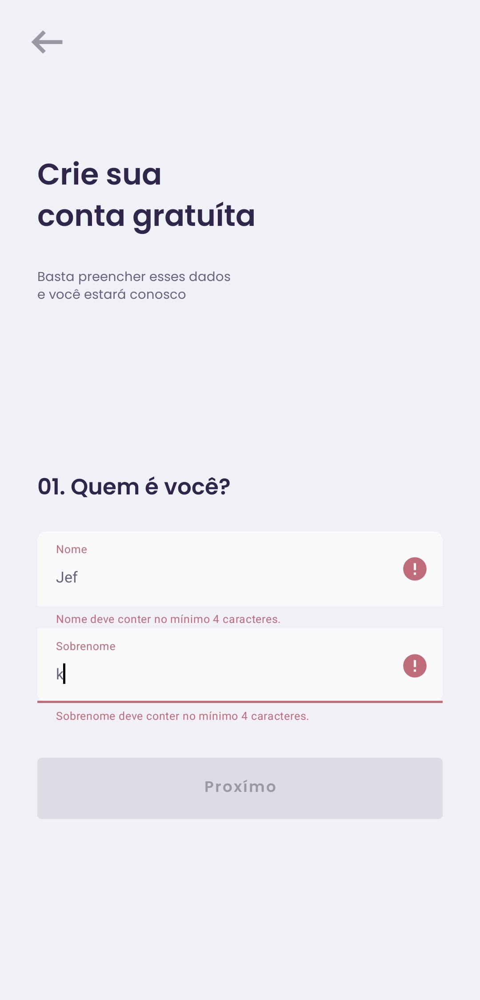

# Proffy Mobile (App Android)

Projeto mobile da plataforma Proffy, desenvolvido em Kotlin para a atividade de validação de formulários.

## Integrantes do Grupo

* Gabriel Alves
* Jefferson Kisley
* Leonardo Augusto
* Saulo Rodrigues

## O que foi implementado

* Fluxo de cadastro de usuário em duas etapas.
* Validação local dos campos:
  * Nome (mínimo 4 caracteres)
  * Sobrenome (mínimo 4 caracteres)
  * E-mail (formato válido)
  * Senha (mínimo 6 caracteres)

## Telas do Aplicativo

