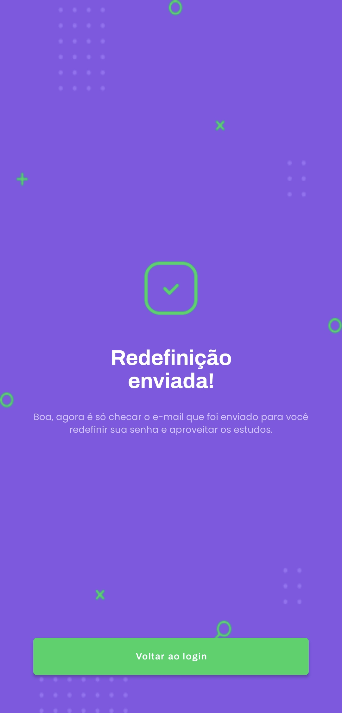

# Implementação da FinallyActivity (Tela de Sucesso)

Este projeto consiste na implementação de um componente reutilizável (`FinallyActivity`) para a aplicação Proffy, utilizado nos fluxos de conclusão de cadastro e recuperação de senha.

#### Discentes
    Laís Pereira
    Daniela Souza
    Gabriel Alves
    Jefferson Kisley

### Alterações Realizadas

* **Componente Reutilizável:** Criação da `FinallyActivity` que recebe dados dinâmicos via `Intent` (título, descrição e texto do botão).
* **Layout Centralizado:** Ajuste das constraints no XML para garantir que o ícone e os textos fiquem centralizados verticalmente e alinhados conforme o design original.
* **Navegação de Cadastro e Recuperação de Senha:** Implementação das lógicas nas `RegisterStepTwoActivity` e `ForgotActivity` para redirecionar para a tela de sucesso e para o Login.
* **Gestão da Pilha de Activities:** Uso de flags (`FLAG_ACTIVITY_CLEAR_TASK`) para impedir que o usuário volte para as telas de formulário após concluir a ação.

## Screenshots

Abaixo estão as capturas de tela dos fluxos funcionando após as correções:

### Fluxo de Cadastro Concluído
_Tela exibida após o usuário finalizar o cadastro com sucesso._

### Fluxo de Recuperação de Senha
_Tela exibida após o usuário solicitar a redefinição de senha._

